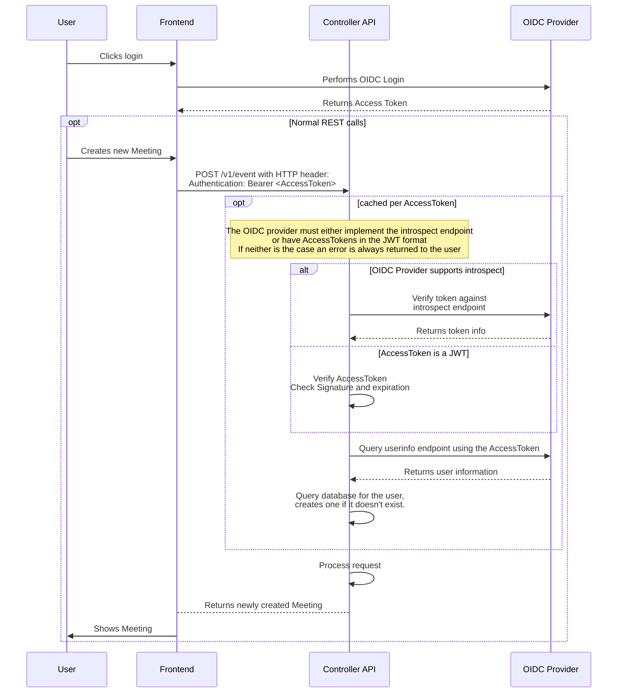

# OIDC Authentication Flow for {{ product_name }} Controller WebAPI Endpoints

This diagram describes the flow of an authentication against the OIDC provider
for accessing the
[{{ product_name }} Controller WebAPI](https://docs.opentalk.eu/developer/controller/rest/).

